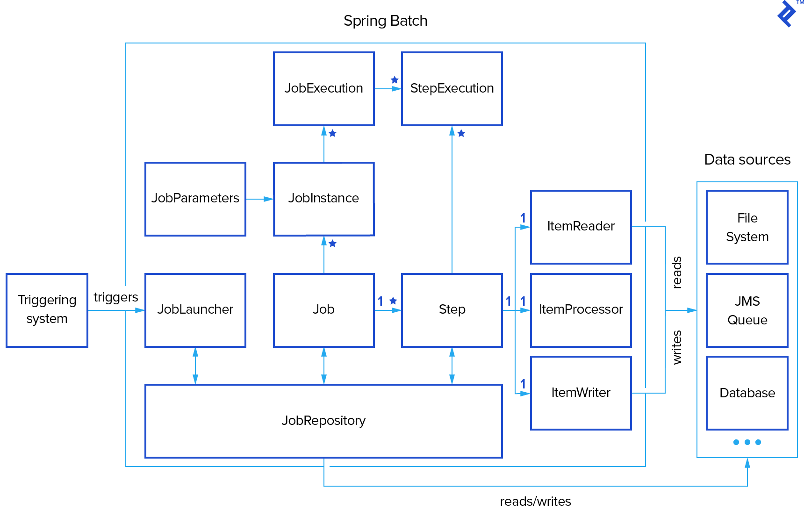
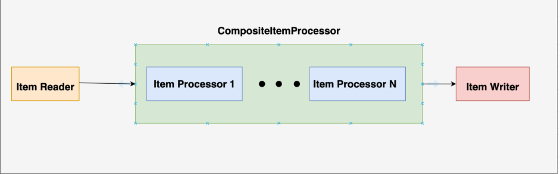

# TRANSACTIONS SPRING BATCH

The provided Spring Batch application follows the principles of the Spring Batch framework, which is designed for efficient processing of large-scale batch processing tasks. Here's a brief overview of how the batch works and the patterns it implements:
.

## 1.  **Job Configuration and Flow Design:**
-   The batch application defines a Spring Batch job (importTransactions) in the BatchConfiguration class.
-   The job is configured to process data in parallel using a split flow (splitFlow method), which consists of two sub-flows: one for CSV input and another for XML input.

## 2.  **Step Configuration:**
- Each flow is further divided into steps (csvStep and xmlStep methods) where data is read, processed, and written.
- Steps are configured to read data in chunks of 10, perform processing using a composite item processor (compositeItemProcessor), and write the results using a custom TransactionWriter.

## 3. **ItemReader Decorator Pattern:**
- The batch uses a decorator pattern with the BaseReaderDecorator class, which is extended by the LoggingTransactionReader class. This allows additional behavior (logging) to be added to any ItemReader.
## 4. **ItemProcessor Composite Pattern:**

- The application uses a composite pattern with the CompositeItemProcessor class, combining two item processors (TransactionProcessor and CompteProcessor) to apply multiple processing steps to each item.
.

## 5. **Custom ItemReader Implementations:**
- The batch uses custom ItemReader implementations (TransactionCsvReader and TransactionXmlReader) to read data from CSV and XML files, respectively. These readers use specific configurations for parsing and mapping data.

## 6. **Database Initialization:**
- The DatabaseInitializer component ensures the database is initialized with an initial set of Compte entities if it is empty.

## 7. **Service Layer for Business Logic:**
- The application follows a service-oriented architecture with CompteService and TransactionService interfaces.
- The implementations (CompteServiceImpl and TransactionServiceImpl) provide business logic for creating, retrieving, and updating entities.

## 8. **Error Handling:**

- The service methods incorporate error handling for cases such as entity not found (EntityNotFoundException) and invalid transactions.
## 9. **Parallel Processing:**

- The job is configured to execute steps in parallel using a SimpleAsyncTaskExecutor, allowing for improved performance in a multi-threaded environment.

# overall:
Overall, the batch application demonstrates a modular and scalable approach to processing large amounts of data using Spring Batch, employing various design patterns to enhance maintainability and flexibility. It adheres to the principles of separation of concerns, reusability, and fault tolerance, common in batch processing applications.
